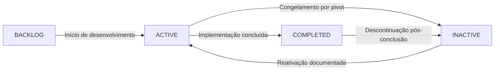

# 🏛️ PROTOCOLO DE GOVERNANÇA INSTITUCIONAL - AURORA v5.1

**Document ID:** GOV-AURORA-5.1-INSTITUTIONAL-20251225  
**Classification:** Governance Protocol  
**Format:** Visual/Structured  
**Version:** 2.0-enterprise  
**Date:** 2025-12-25  
**Status:** Production  
**Framework:** FSM Institutional v3.0

---

## 📋 ÍNDICE VISUAL

```yaml
ESTRUTURA:
  PRINCÍPIOS: "Fundamentos da Governança"
  FSM: "Máquina de Estados (Estados e Transições)"
  PROTOCOLO_IA: "Protocolo Operacional para Agentes IA"
  PIVOT_PROTECTION: "Proteção contra Mudanças Não Autorizadas"
  AUDIT_TRAIL: "Rastreabilidade Imutável"
  COMPLIANCE: "Frameworks Regulatórios"
```

---

## 🎯 PRINCÍPIOS FUNDAMENTAIS

### 1. 🔒 AUDIT TRAIL IMUTÁVEL

```
┌─────────────────────────────────────────────────────────┐
│  WORM (Write-Once-Read-Many) Compliance               │
│  • Logs nunca são alterados ou deletados                │
│  • Replicação automática para SIEM corporativo          │
│  • Retenção: 7 anos (FINRA 4511 compliant)             │
└─────────────────────────────────────────────────────────┘
```

### 2. 🔄 FSM INSTITUCIONAL

```
┌─────────────────────────────────────────────────────────┐
│  Finite State Machine com Transições Controladas       │
│  • Estados: BACKLOG → ACTIVE → COMPLETED/INACTIVE      │
│  • Transições validadas antes de execução              │
│  • Bloqueio automático de transições não autorizadas   │
└─────────────────────────────────────────────────────────┘
```

### 3. 🛡️ PIVOT PROTECTION

```
┌─────────────────────────────────────────────────────────┐
│  Proteção contra Mudanças Não Autorizadas              │
│  • Módulos INACTIVE: bloqueio total de execução         │
│  • Requer reativação explícita documentada             │
│  • Nunca sobrescreve módulos existentes                 │
└─────────────────────────────────────────────────────────┘
```

### 4. 🔢 CONSISTENCY BY DESIGN

```
┌─────────────────────────────────────────────────────────┐
│  IDs MOD-XXX Sequenciais e Únicos                       │
│  • IDs nunca são reutilizados                           │
│  • Sequência garantida: MOD-001, MOD-002, MOD-003...   │
│  • Validação automática de duplicatas                   │
└─────────────────────────────────────────────────────────┘
```

---

## 🔄 MÁQUINA DE ESTADOS (FSM)

### Estados Disponíveis

| Estado | Descrição | Cor |
|--------|-----------|-----|
| **BACKLOG** | Identificado, não iniciado | 🟡 Amarelo |
| **ACTIVE** | Em desenvolvimento/operação ativa | 🟢 Verde |
| **INACTIVE** | Congelado/descontinuado (somente leitura) | 🔴 Vermelho |
| **COMPLETED** | Implementado e validado | 🔵 Azul |

### Transições Autorizadas



**Tabela de Transições:**

| Estado Atual | Transições Permitidas |
|--------------|----------------------|
| **BACKLOG** | → ACTIVE |
| **ACTIVE** | → INACTIVE, → COMPLETED |
| **INACTIVE** | → ACTIVE |
| **COMPLETED** | → INACTIVE |

---

## 🤖 PROTOCOLO OPERACIONAL PARA AGENTES IA

### 1. SINCRONIZAÇÃO PRÉ-TAREFA

```yaml
ANTES_DE_QUALQUER_ACAO:
  passo_1: "Verificar status do módulo em project_manifest.json"
  passo_2: "Se status = BACKLOG → registrar log_event de ativação primeiro"
  passo_3: "Se status = INACTIVE → solicitar reativação documentada"
  passo_4: "Validar transição FSM antes de prosseguir"
```

**Exemplo de Código:**

```python
# ✅ CORRETO: Verificar antes de agir
orchestrator = FinancialProjectOrchestrator()
module_status = orchestrator.state["modules"]["MOD-001"]["status"]

if module_status == "INACTIVE":
    # BLOQUEIO: Requer reativação explícita
    result = orchestrator.log_event(
        mod_id="MOD-001",
        action_desc="Reativação para correção de bug crítico",
        status_type="active",
        actor="AIC_Agent"
    )
```

### 2. EXECUÇÃO CONTROLADA

```yaml
FLUXO_DE_EXECUCAO:
  antes: "Registrar intenção (status_type='active')"
  durante: "Executar alteração de código"
  depois: "Registrar conclusão (status_type='completed')"
  validacao: "Testes de stress e sistema completo obrigatórios"
```

**Checklist Obrigatório:**

- [ ] Status verificado antes de iniciar
- [ ] Intenção registrada no audit trail
- [ ] Alteração de código executada
- [ ] Testes de stress aplicados
- [ ] Validação de sistema completo
- [ ] Conclusão registrada com evidências

### 3. GESTÃO DE CRISE (PIVOT)

```yaml
PIVOT_PROTECTION:
  descontinuar: "status_type='inactive' com justificativa"
  retomar: "status_type='active' com documentação completa"
  bloqueio: "Módulos INACTIVE: execução automática bloqueada"
```

**Exemplo de Congelamento:**

```python
# Congelar módulo problemático
orchestrator.log_event(
    mod_id="MOD-042",
    action_desc="Congelamento temporário devido a inconsistências detectadas",
    status_type="inactive",
    actor="CKO_Agent",
    metadata={"reason": "Discrepância de módulos detectada", "requires_review": True}
)
```

### 4. AUDIT TRAIL OBRIGATÓRIO

```yaml
AUDIT_TRAIL_DUPLO:
  nivel_1: "Log do módulo (histórico local)"
  nivel_2: "Log global (audit trail institucional)"
  campos_obrigatorios:
    - timestamp
    - actor
    - estado_anterior
    - novo_estado
    - acao_descricao
    - contexto_regulatorio
```

---

## 🛡️ PIVOT PROTECTION - DETALHES

### Bloqueios Automáticos

```
┌─────────────────────────────────────────────────────────┐
│  🚨 BLOQUEIO POR PIVOT PROTECTION                       │
│                                                          │
│  Módulo: MOD-XXX                                        │
│  Status Atual: INACTIVE                                 │
│  Ação Solicitada: [ação]                               │
│                                                          │
│  REQUER: Reativação explícita com                     │
│          status_type='active' ou 'confirmed'            │
└─────────────────────────────────────────────────────────┘
```

### Validação FSM

```
┌─────────────────────────────────────────────────────────┐
│  🚨 TRANSIÇÃO FSM NÃO AUTORIZADA                        │
│                                                          │
│  Estado Atual: [estado_atual]                          │
│  Estado Solicitado: [estado_novo]                      │
│  Módulo: MOD-XXX                                        │
│                                                          │
│  Transições Permitidas: [lista_permitida]              │
└─────────────────────────────────────────────────────────┘
```

---

## 📊 COMPLIANCE E FRAMEWORKS REGULATÓRIOS

### Frameworks Suportados

| Framework | Versão | Aplicabilidade |
|-----------|--------|----------------|
| **MiFID II** | Artigo 16, 48 | Trading e Execução |
| **Basel III** | Pillar 1, 2, 3 | Gestão de Risco |
| **SEC Rule 611** | Reg NMS | Execução de Ordens |
| **GDPR** | Art. 25, 32 | Proteção de Dados |
| **FINRA 4511** | 7 anos | Retenção de Logs |

### Adicionar Tags de Compliance

```python
# Adicionar tag de compliance a um módulo
orchestrator.add_compliance_tag(
    mod_id="MOD-001",
    framework="MiFID II",
    version="Artigo 16, 48"
)
```

---

## 📈 RELATÓRIOS E VISUALIZAÇÃO

### Relatório Executivo

```python
# Gerar relatório completo
report = orchestrator.generate_report(detailed=True)

# Estatísticas disponíveis:
# - TOTAL_MODULES
# - BY_STATUS (distribuição por estado)
# - BY_SOURCE (distribuição por origem)
# - RISK_ANALYSIS (análise de risco)
# - MODULES_DETAILED (detalhes por módulo)
```

### Busca de Eventos

```python
# Buscar eventos no log global
events = orchestrator.search_events(
    search_term="Quantum Firewall",
    event_type="COMPLETED",
    actor="CRO",
    start_date="2025-12-01",
    end_date="2025-12-25"
)
```

---

## 🔗 INTEGRAÇÃO COM AURORA

### Arquivo de Manifesto

**Localização:** `project_manifest.json`

**Estrutura:**

```json
{
  "metadata": {
    "project": "AURORA Trading System v5.1",
    "version": "2.0-enterprise",
    "governance_framework": "FSM Institutional v3.0",
    "compliance_frameworks": ["MiFID II", "Basel III", "SEC Rule 611", "GDPR"]
  },
  "modules": {
    "MOD-001": {
      "name": "Quantum Firewall",
      "status": "ACTIVE",
      "actions": [...],
      "compliance_tags": [...]
    }
  },
  "global_logs": [...]
}
```

### Scripts de Integração

- [🔧 financial_governance_orchestrator.py](00-Governanca/financial_governance_orchestrator.py) - Orquestrador principal
- [🔧 GERAR_RELATORIO_GOVERNANCA.py](GERAR_RELATORIO_GOVERNANCA.py) - Relatórios visuais
- [🔧 VALIDAR_TRANSICOES_FSM.py](VALIDAR_TRANSICOES_FSM.py) - Validação de transições

---

## ✅ CHECKLIST DE CONFORMIDADE

### Antes de Qualquer Alteração

- [ ] Status do módulo verificado em `project_manifest.json`
- [ ] Transição FSM validada
- [ ] Pivot Protection verificada (módulo não está INACTIVE)
- [ ] Intenção registrada no audit trail

### Durante a Execução

- [ ] Alteração de código executada
- [ ] Testes unitários aplicados
- [ ] Testes de integração aplicados
- [ ] Testes de stress aplicados
- [ ] Validação de sistema completo

### Após Conclusão

- [ ] Evento de conclusão registrado
- [ ] Evidências de testes anexadas
- [ ] Tags de compliance atualizadas
- [ ] Relatório gerado e validado

---

## 🎨 VISUALIZAÇÃO DE ESTADOS

### Cores por Status

```
🟡 BACKLOG   → Aguardando início
🟢 ACTIVE    → Em desenvolvimento/operação
🔴 INACTIVE  → Congelado (bloqueado)
🔵 COMPLETED → Implementado e validado
```

### Indicadores Visuais

```
✅ = Operação autorizada e executada
❌ = Operação bloqueada
⚠️  = Aviso (requer atenção)
🚨 = Bloqueio crítico (Pivot Protection ou FSM)
```

---

## 📚 REFERÊNCIAS

- [📄 financial_governance_orchestrator.py](00-Governanca/financial_governance_orchestrator.py) - Implementação completa
- [📄 project_manifest.json](project_manifest.json) - Manifesto de governança
- [📄 AURORA_SISTEMA_SINTETIZADO_FINAL_V5.1.md](AURORA_SISTEMA_SINTETIZADO_FINAL_V5.1.md) - Documentação técnica

---

**END OF GOVERNANCE PROTOCOL**

*Protocolo criado em: 2025-12-25*  
*Framework: FSM Institutional v3.0*  
*Status: Production Ready*  
*Compliance: MiFID II, Basel III, SEC Rule 611, GDPR*

