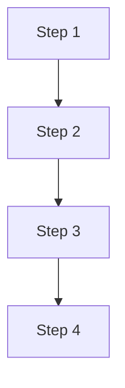

# Process: [Nome do Processo]
Version: [X.Y.Z]  
Owner: [Nome do Responsável]  

## Overview
[Descrição geral do processo]

## Flow Diagram

## Steps
1. [Step 1]
   - [Sub-step 1.1]
   - [Sub-step 1.2]
   - [Sub-step 1.3]

2. [Step 2]
   - [Sub-step 2.1]
   - [Sub-step 2.2]
   - [Sub-step 2.3]

3. [Step 3]
   - [Sub-step 3.1]
   - [Sub-step 3.2]
   - [Sub-step 3.3]

## Error Handling
- [Error 1]: [Resolution]
- [Error 2]: [Resolution]
- [Error 3]: [Resolution]

## Dependencies
- [Dependency 1]: [Version]
- [Dependency 2]: [Version]
- [Dependency 3]: [Version]

## Security Requirements
- [Requirement 1]
- [Requirement 2]
- [Requirement 3]

## Monitoring
- [Metric 1]: [Threshold]
- [Metric 2]: [Threshold]
- [Metric 3]: [Threshold]

## Maintenance
- [Task 1]: [Frequency]
- [Task 2]: [Frequency]
- [Task 3]: [Frequency] 